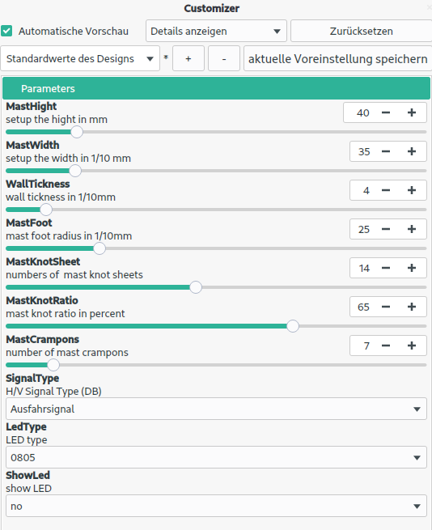

# HV-Signal

A simple generator for German HV signals for different track widths. Default is TT (1:120).

Open the scad file and play with the parameters in the Customizer (pay attention to the back of the aperture and select the appropriate LED type). The default values are intended for gauge size TT. 

When generating the STL file for printing, the LEDs must be switched off as placeholders. For printing on an SLA printer, only suitable support structures for the apertures have to be created

